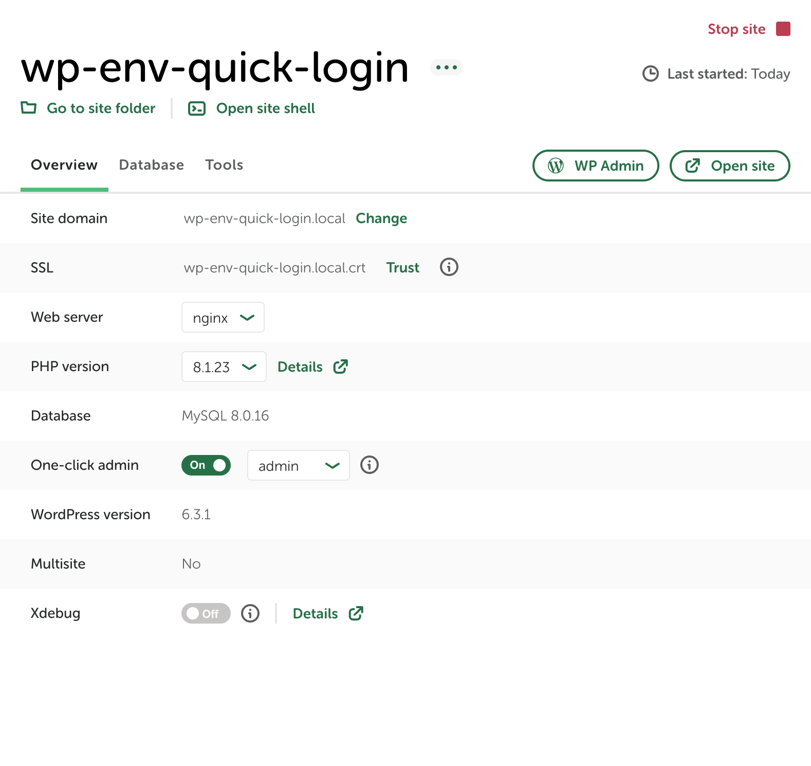

# Pronamic `wp-env` quick login

Quickly log in as a specified WordPress user in your `wp-env` environment.

## Inspired by the "One-click admin" feature from [Local](https://localwp.com/)



```php
<?php
/**
 * This is a PHP script that is auto-added to Local's PHP Lightning Service php.ini's
 * via auto_prepend_script to add relevant constants.
 *
 * @copyright Copyright (c) 2020, WP Engine
 */
define( 'WP_ENVIRONMENT_TYPE', 'local' );

function localwp_auto_login() {
	/**
	 * Do not auto-login if X-Original-Host header is present.
	 *
	 * This prevents auto login from being used over Live Links Pro.
	 */
	if ( !empty( $_SERVER['HTTP_X_ORIGINAL_HOST'] ) ) {
		return;
	}

	if ( empty( $_GET['localwp_auto_login'] ) ) {
		return;
	}

	if ( ! function_exists( 'wp_set_auth_cookie' ) ) {
		return;
	}

	$admin_id = $_GET['localwp_auto_login'];

	$user     = get_user_by( 'id', $admin_id );

	if ( ! is_wp_error( $user ) ) {
		wp_clear_auth_cookie();
		wp_set_current_user( $user->ID );
		wp_set_auth_cookie( $user->ID, false, is_ssl() );

		do_action( 'wp_login', $user->user_login, $user );
		$redirect_to = user_admin_url();
		wp_safe_redirect( $redirect_to );
		exit();
	}
}

$GLOBALS['wp_filter'] = array(
	'init' => array(
		10 => array(
			'localwp_auto_login' => array(
				'function'      => 'localwp_auto_login',
				'accepted_args' => 1,
			),
		),
	),
);
```

_Source: https://github.com/roots/bedrock/issues/672#issuecomment-1481851251_
